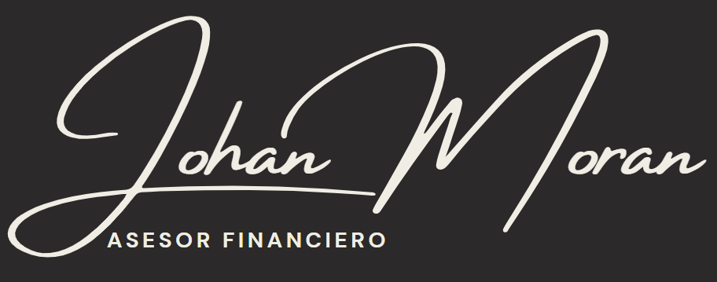

<html lang="es">
<head>
  <meta charset="UTF-8">
  <meta name="viewport" content="width=device-width, initial-scale=1.0, maximum-scale=1.0, user-scalable=no">
  <title>Calculadora de Interés Compuesto</title>
  
  <link rel="stylesheet" href="https://cdnjs.cloudflare.com/ajax/libs/font-awesome/6.0.0/css/all.min.css">
  
</head>
<body>
  <button class="dark-mode-btn" onclick="toggleDarkMode()"><i class="fas fa-moon"></i> Modo Oscuro</button>

  

    
  

  

    <!-- Columna izquierda - Inputs -->
    

      

        <h3><i class="fas fa-coins"></i> Depósito inicial
          

            <i class="fas fa-question-circle tooltip-icon"></i>
            쮺on qué cantidad vas a comenzar tu inversión?
          

        </h3>
        

          <input type="text" id="capitalInicial" placeholder="$0">
        

        

          <label for="tasa">Tasa de interés anual (%):
            

              <i class="fas fa-question-circle tooltip-icon"></i>
              Tasa de rendimiento anual que ofrece la institución financiera
            

          </label>
          <input type="number" id="tasa" step="0.01" placeholder="0">
        

      

      

        <h3><i class="far fa-calendar-alt"></i> Plazo para invertir
          

            <i class="fas fa-question-circle tooltip-icon"></i>
            Periodo de tiempo que mantendrás tu inversión
          

        </h3>
        

          <label for="tipoPlazo">Tipo de plazo:</label>
          <select id="tipoPlazo">
            <option value="anual">Periodo Anual</option>
            <option value="mensual">Periodo Mensual</option>
          </select>
        

        

          <label id="labelPlazo" for="plazo">Cantidad de años:
            

              <i class="fas fa-question-circle tooltip-icon"></i>
              Horizonte de tiempo para tu inversión
            

          </label>
          <input type="number" id="plazo" min="1" placeholder="0">
        

        

          <label for="frecuencia">Frecuencia de capitalización:
            

              <i class="fas fa-question-circle tooltip-icon"></i>
              Con qué frecuencia se reinvertirán los intereses
            

          </label>
          <select id="frecuencia">
            <option value="12" selected>Mensualmente</option>
            <option value="4">Trimestral</option>
            <option value="2">Semestral</option>
            <option value="1">Anualmente</option>
          </select>
        

      

      

        <h3><i class="fas fa-hand-holding-usd"></i> Aportaciones adicionales
          

            <i class="fas fa-question-circle tooltip-icon"></i>
            Depósitos periódicos adicionales a tu inversión inicial
          

        </h3>
        

          <label for="aportacion">Monto:
            

              <i class="fas fa-question-circle tooltip-icon"></i>
              Cantidad que aportarás periódicamente
            

          </label>
          <input type="text" id="aportacion" placeholder="$0">
        

        

          <label for="frecuenciaAportacion">Frecuencia de aportación:
            

              <i class="fas fa-question-circle tooltip-icon"></i>
              Con qué frecuencia realizarás aportaciones
            

          </label>
          <select id="frecuenciaAportacion">
            <option value="12" selected>Mensualmente</option>
            <option value="4">Trimestral</option>
            <option value="2">Semestral</option>
            <option value="1">Anualmente</option>
          </select>
        

      

    

    <!-- Columna derecha - Resultados -->
    

      

        <h3><i class="fas fa-chart-pie"></i> Resumen de inversión</h3>
        

          Depósito inicial
          $0.00
        

        

          Depósitos adicionales
          $0.00
        

        

          Interés acumulado
          $0.00
        

        

          Total acumulado
          $0.00
        

      

      

        <canvas id="graficaBarras"></canvas>
      

      
      

        

          <h3><i class="fas fa-table"></i> Detalle de crecimiento</h3>
          

            <table id="tablaResultados">
              <thead>
                <tr>
                  <th>Periodo</th>
                  <th>Depósito inicial</th>
                  <th>Aportaciones</th>
                  <th>Intereses</th>
                  <th>Total acumulado</th>
                </tr>
              </thead>
              <tbody>
                <!-- Aquí se insertarán las filas dinámicamente -->
              </tbody>
            </table>
          

        

      

    

  

  <a href="https://wa.me/523318853923?text=Hola,%20me%20interesa%20saber%20más%20sobre%20inversiones%20💰📈" class="whatsapp-btn" target="_blank" title="Contactar por WhatsApp">
    <i class="fab fa-whatsapp"></i>
  </a>

  
</body>
</html>
